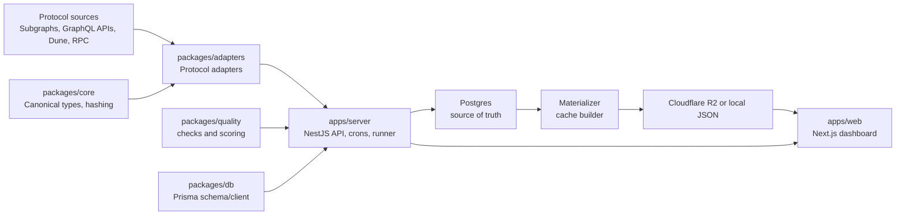

# LendingScope

Open lending market intelligence built around protocol adapters, daily historical storage, and fast materialized JSON reads.

LendingScope collects lending market state from public protocol data sources, normalizes it into one canonical schema, stores the source-of-truth history in Postgres, and publishes dashboard-friendly JSON files to local cache or Cloudflare R2. The frontend is a Next.js dashboard that reads the NestJS API and materialized cache.

## What This Project Does

- Tracks current and historical lending markets across Aave V3, Aave V4, Spark, Compound V3, and Morpho Blue.
- Stores daily market snapshots with APY, supplied liquidity, borrowed liquidity, utilization, status, provenance, and quality score.
- Keeps adapters self-contained, so each protocol owns its source config and normalization logic.
- Separates ingestion from materialization: one job writes Postgres, another job publishes read-optimized JSON.
- Serves a dashboard with protocol, chain, asset, market detail, chart, methodology, and source views.

## System Overview



Postgres is the source of truth. R2/local JSON is a public read cache.

## Repository Layout

```txt
apps/
  server/        NestJS API, schedulers, ingestion runner, materializer
  web/           Next.js dashboard

packages/
  adapters/      Protocol-specific adapters and shared adapter helpers
  core/          Canonical lending types and hashing helpers
  db/            Prisma schema, migrations, Prisma client export
  quality/       Reusable market quality checks and scoring

docs/            Architecture, data model, adapter, API, and ops docs
scripts/         Repo-level Prisma and test wrappers
```

## Documentation

- [Concepts](docs/concepts.md)
- [Architecture](docs/architecture.md)
- [Working Locally](docs/working-locally.md)
- [Adapters](docs/adapters.md)
- [Data Model](docs/data-model.md)
- [Ingestion And Materialization](docs/ingestion-and-materialization.md)
- [API](docs/api.md)
- [Frontend](docs/frontend.md)
- [Deployment And Operations](docs/deployment-and-ops.md)

## Quickstart

Requirements:

- Node.js 22+
- pnpm 10+
- Docker, if running local Postgres
- The Graph API key for subgraph-backed adapters

```bash
pnpm install
cp .env.example .env
docker compose up -d postgres
pnpm db:migrate
pnpm db:generate
pnpm typecheck
```

Start the API and web app:

```bash
pnpm dev
```

Defaults:

```txt
API:  http://localhost:4000
Web:  http://localhost:3000/lending
```

For local development without Cloudflare R2 credentials, the materializer writes JSON under `apps/server/public/data`.

For a fuller local runbook, see [Working Locally](docs/working-locally.md).

## Environment

Core variables:

```txt
DATABASE_URL
ADMIN_API_KEY
PORT
NEXT_PUBLIC_API_BASE_URL
THE_GRAPH_API_KEY
THE_GRAPH_GATEWAY_URL
```

Optional RPC variables are used to resolve historical UTC dates to block numbers during backfills:

```txt
ETHEREUM_RPC_URL
BASE_RPC_URL
```

Optional R2 variables enable public cache uploads:

```txt
R2_ACCOUNT_ID
R2_ENDPOINT_URL
R2_ACCESS_KEY_ID
R2_SECRET_ACCESS_KEY
R2_BUCKET
R2_PUBLIC_BASE_URL
```

`R2_ENDPOINT_URL` is the authenticated S3-compatible endpoint used by the server. `R2_PUBLIC_BASE_URL` must be a browser-readable custom domain or `r2.dev` URL.

See [.env.example](.env.example) for the full list.

## Main Commands

```bash
pnpm dev                  # Run API and web dev servers
pnpm dev:server           # Run only NestJS API
pnpm dev:web              # Run only Next.js
pnpm build                # Build all workspace packages
pnpm typecheck            # Typecheck all workspace packages
pnpm test                 # Run unit tests

pnpm db:migrate           # Local Prisma migration
pnpm db:deploy            # Deploy Prisma migrations
pnpm db:generate          # Generate Prisma client

pnpm ingest               # Run current adapter ingestion once
pnpm materialize          # Build full local/R2 JSON cache
pnpm materialize:current  # Build current-lite cache only
pnpm r2:clear             # Delete configured R2 lending prefix
pnpm history -- latest    # Fetch adapter data for latest/current
pnpm backfill:daily       # Backfill one date range day-by-day
pnpm backfill:chunked     # Backfill by adapter/chain/date chunks
```

## How Data Flows

```txt
adapter source fetch
  -> raw payload with source method and payload hash
  -> canonical market snapshot
  -> quality checks and score
  -> Postgres tables
  -> daily snapshot projection
  -> materialized JSON files
  -> API/dashboard reads
```

Daily snapshots power historical charts and current market rows. Current rows filter out markets with `totalSuppliedUsd <= 10000`.

## Crons

The NestJS server has two independent daily crons:

```txt
01:05 UTC  ingestion cron       adapter runner -> Postgres
01:35 UTC  materializer cron    Postgres -> local JSON/R2
```

Disable both with:

```txt
DISABLE_SCHEDULER=1
```

Disable only one side:

```txt
DISABLE_INGESTION_SCHEDULER=1
DISABLE_MATERIALIZER_SCHEDULER=1
```

## Public API

```txt
GET /api/lending/manifest
GET /api/lending/markets/current
GET /api/lending/protocols/:protocol
GET /api/lending/protocols/:protocol/timeseries?range=30d|90d|365d|all&year=2026
GET /api/lending/protocols/:protocol/pools/:marketId/chart?range=30d|all&year=2026
GET /api/lending/chains/:chain
GET /api/lending/assets/:asset
GET /api/lending/markets/:marketId/history?range=30d|90d|365d|all
GET /api/lending/rankings?asset=USDC&sort=supplyApy
GET /api/lending/quality
GET /api/lending/anomalies
GET /api/lending/sources/:marketId
```

Internal endpoints require `x-admin-api-key: $ADMIN_API_KEY`:

```txt
POST /api/internal/ingest-now
POST /api/internal/materialize-now
GET /api/internal/ingestion-runs
GET /api/internal/raw-payload/:id
```

## Materialized Cache Layout

The materializer writes files under `lending/` locally and to R2 when configured:

```txt
lending/manifest.json
lending/current.json
lending/current-lite.json
lending/quality.json
lending/anomalies.json
lending/protocols/{protocol}/manifest.json
lending/protocols/{protocol}/current.json
lending/protocols/{protocol}/pools/{marketId}/current.json
lending/protocols/{protocol}/pools/{marketId}/chart-30d.json
lending/protocols/{protocol}/pools/{marketId}/chart-1d/{year}.json
lending/chains/{chain}.json
lending/assets/{asset}.json
```

The API also keeps a short memory cache for hot public reads.

## Validation

Use this before pushing:

```bash
pnpm typecheck
pnpm test
pnpm --filter @lendingscope/web build
```

Adapter-specific latest/date checks:

```bash
pnpm test aave latest
pnpm test aave-v4 2026-07-15
pnpm test spark 2026-07-15
pnpm test compound 2026-07-15
pnpm test morpho 2026-07-15
```

These commands run the history CLI for the selected adapter.

## Current Status

Implemented adapters:

- `aave-v3`
- `aave-v4`
- `spark`
- `compound-v3`
- `morpho-blue`

Current storage strategy:

- Raw/current ingestion rows are retained for provenance.
- Daily snapshots are the compact historical source of truth.
- Materialized JSON is generated from daily snapshots.
- Full historical charts use yearly per-pool files to avoid giant protocol payloads.

## License And Affiliation

This is an independent technical prototype for open lending analytics, built from public protocol data. It is not affiliated with any analytics platform or protocol.
