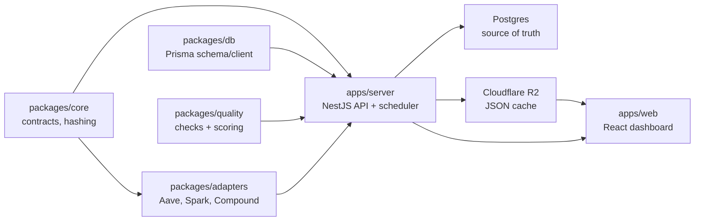

# Stablewatch Lending Analytics

Adapter-first lending analytics prototype for Stablewatch-style markets. The backend is a single NestJS server that runs protocol adapters, stores raw and canonical lending snapshots in Postgres, executes quality checks, and materializes public JSON to Cloudflare R2-compatible object storage. The frontend is a React/Vite dashboard served by the same NestJS app after build.

## Architecture



Package boundaries:

```txt
packages/adapters = protocol-specific collection and normalization
packages/core     = canonical contracts, hashing
packages/db       = Prisma schema and client export
packages/quality  = reusable checks and scoring
apps/server       = scheduling, orchestration, persistence, APIs, R2 materialization
apps/web          = lending dashboard
```

The adapter package is intentionally internal for v1. It can be extracted later if adapters need independent release/version ownership.

## What Is Implemented

- Monorepo with `apps/server`, `apps/web`, `packages/adapters`, `packages/core`, `packages/db`, and `packages/quality`.
- MVP adapters for `aave-v3`, `spark`, and `compound-v3`.
- Self-contained Aave, Spark, and Compound adapters that fetch current market state from subgraphs and normalize it into a shared lending schema.
- Prisma/Postgres models for ingestion runs, raw payloads, canonical snapshots, quality checks, materialization runs, and R2 objects.
- Hourly NestJS scheduler using `@nestjs/schedule`.
- Manual internal endpoints protected by `ADMIN_API_KEY`.
- R2-compatible uploader using the AWS S3 SDK.
- Local JSON cache writer for development when R2 env vars are absent.
- React dashboard with overview, markets, detail, quality, and source provenance pages.

The adapters follow the DefiLlama-style ownership model: each protocol module owns its deployment/source config, discovers markets from its configured source, collects raw payloads, and returns normalized metrics through the shared lending adapter contract. The NestJS runner only orchestrates adapters; it does not know protocol markets ahead of time.

## Setup

```bash
pnpm install
cp .env.example .env
docker compose up -d postgres
pnpm db:migrate
pnpm build
```

For local-only JSON cache, leave the R2 env vars empty. To upload materialized JSON to Cloudflare R2, set:

```txt
R2_ACCOUNT_ID
R2_ENDPOINT_URL
R2_ACCESS_KEY_ID
R2_SECRET_ACCESS_KEY
R2_BUCKET
R2_PUBLIC_BASE_URL
```

`R2_ENDPOINT_URL` is the authenticated S3-compatible endpoint used for writes. `R2_PUBLIC_BASE_URL` must be a public R2 custom domain or `r2.dev` URL used by browsers; do not set it to the `r2.cloudflarestorage.com` S3 endpoint.

The shipped adapters are subgraph-only. Historical/date backfills still need an RPC endpoint to resolve UTC dates to block numbers; the CLI falls back to public RPCs when these are empty:

```txt
ETHEREUM_RPC_URL
BASE_RPC_URL
```

The Graph is required for the shipped Aave, Spark, and Compound adapters:

```txt
THE_GRAPH_API_KEY
THE_GRAPH_GATEWAY_URL
AAVE_V3_ETHEREUM_SUBGRAPH_ID
AAVE_V3_BASE_SUBGRAPH_ID
SPARK_ETHEREUM_SUBGRAPH_ID
COMPOUND_V3_ETHEREUM_SUBGRAPH_ID
COMPOUND_V3_BASE_SUBGRAPH_ID
```

Adapters are source-specific rather than fallback-based. The current MVP uses GraphQL subgraphs for all three protocols. Future adapters can use API, GraphQL, RPC, or Dune by adding a source-specific helper and wiring the protocol adapter directly to that helper.

## Run

Start both apps during development:

```bash
pnpm dev
```

Manual ingestion and materialization:

```bash
pnpm ingest
pnpm materialize
```

Fetch historical snapshots for specific UTC dates:

```bash
pnpm history -- 2026-07-12 2026-07-13
```

The NestJS API defaults to:

```txt
http://localhost:4000
```

The Vite dashboard defaults to:

```txt
http://localhost:5173/lending
```

After `pnpm build`, NestJS serves the built dashboard from `apps/web/dist`.

## API

Public lending endpoints:

```txt
GET /api/lending/manifest
GET /api/lending/markets/current
GET /api/lending/markets/:marketId/history?range=7d|30d|90d
GET /api/lending/rankings?asset=USDC&sort=supplyApy
GET /api/lending/quality
GET /api/lending/anomalies
GET /api/lending/sources/:marketId
GET /api/lending/protocols/:protocol
GET /api/lending/chains/:chain
GET /api/lending/assets/:asset
```

Internal endpoints require `x-admin-api-key: $ADMIN_API_KEY`:

```txt
POST /api/internal/ingest-now
POST /api/internal/materialize-now
GET /api/internal/ingestion-runs
GET /api/internal/raw-payload/:id
```

## R2 JSON Keys

The materializer writes local cache files under `apps/server/public/data` and uploads the same object bodies to R2 when configured:

```txt
lending/manifest.json
lending/current.json
lending/quality.json
lending/anomalies.json
lending/protocols/aave-v3.json
lending/protocols/spark.json
lending/protocols/compound-v3.json
lending/chains/ethereum.json
lending/chains/base.json
lending/assets/usdc.json
lending/markets/{marketId}/history-30d.json
```

Postgres is the source of truth. R2 is only the public read cache.

## Validation

```bash
pnpm test
pnpm typecheck
```

Current focused tests cover adapter normalization, canonical schema validation, APY/unit behavior, and quality scoring checks.

## Source Notes

- Aave V3: discovers reserves and fetches current reserve state from official Aave V3 subgraphs.
- Spark: discovers markets and fetches state from the Spark Messari lending subgraph.
- Compound III: discovers markets and fetches state from the Compound Messari lending subgraph.
- Shared source helpers are intentionally small and explicit. A protocol adapter should choose one source path for a run; do not silently fall back between API, GraphQL, RPC, or Dune inside the adapter.

Keep the raw payload in `raw_market_snapshots.payloadJson`, then normalize into `market_snapshots`. This preserves provenance, replayability, and quality auditing.
