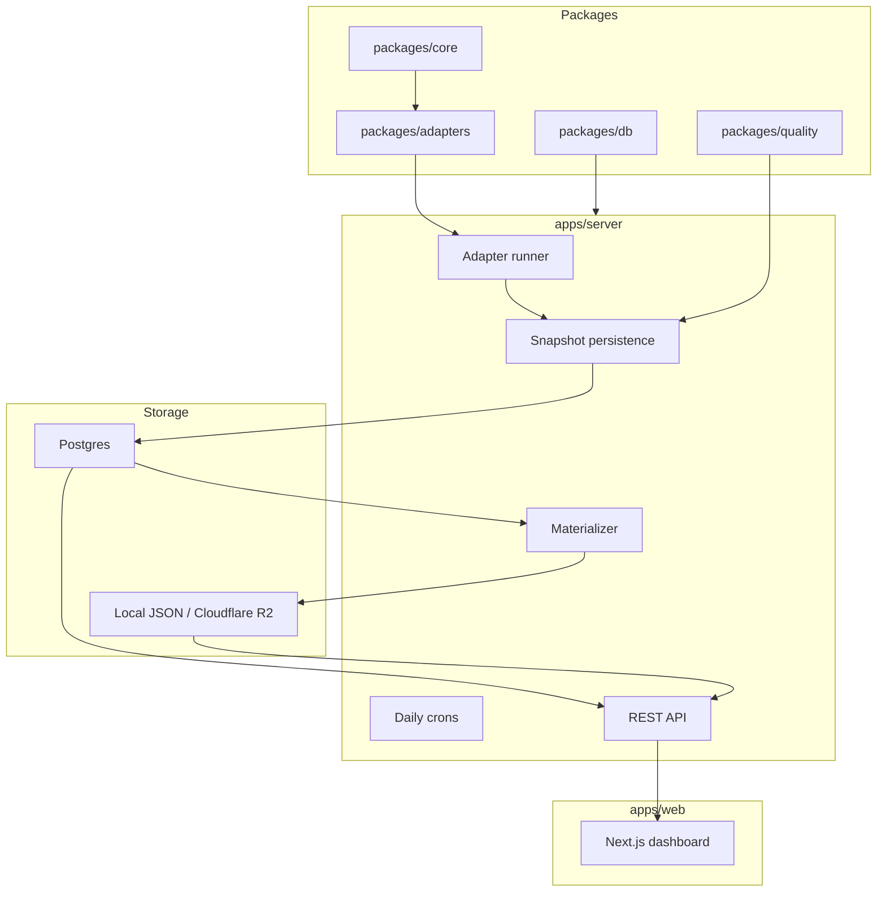

# Architecture

LendingScope is a monorepo with isolated packages and one backend server.



## Package Responsibilities

`packages/core`

- canonical TypeScript contracts
- raw/canonical lending market types
- hashing helpers

`packages/adapters`

- protocol adapters
- adapter registry
- shared adapter helpers used by multiple adapters
- chain and RPC helpers
- GraphQL helper

`packages/db`

- Prisma schema
- migrations
- generated Prisma client export

`packages/quality`

- reusable checks
- quality scoring

`apps/server`

- NestJS application
- scheduler setup
- adapter runner
- Postgres persistence
- daily snapshot projection
- materializer
- R2 upload service
- public and internal APIs

`apps/web`

- Next.js dashboard
- market table
- detail pages
- charts
- methodology/source views

## Why This Shape

The architecture is adapter-first because protocol data sources differ. Aave, Spark, Compound, and Morpho do not expose the exact same schema, and future adapters may use Dune, RPC logs, or first-party APIs.

The server stays protocol-agnostic. It asks adapters for normalized snapshots, writes the database, runs quality checks, and builds cache files.

The materialized JSON layer exists because public dashboard reads should be fast and cheap. Large historical chart reads are split into pool-level and year-level files instead of loading one huge protocol blob.

## Runtime Flow

```txt
NestJS cron or CLI
  -> adapter runner
  -> selected adapter.fetch()
  -> raw payload rows
  -> canonical snapshot rows
  -> quality checks
  -> daily snapshot projection/upsert
  -> materializer builds JSON files
  -> R2 upload and local cache write
  -> dashboard/API reads cache
```

## Failure Boundaries

- Adapter failure should not require changing API code.
- R2 failure should not corrupt Postgres.
- Materialization failure creates a failed `MaterializationRun`.
- Ingestion failure creates a failed `IngestionRun`.
- Existing materialized files remain available until replaced.
